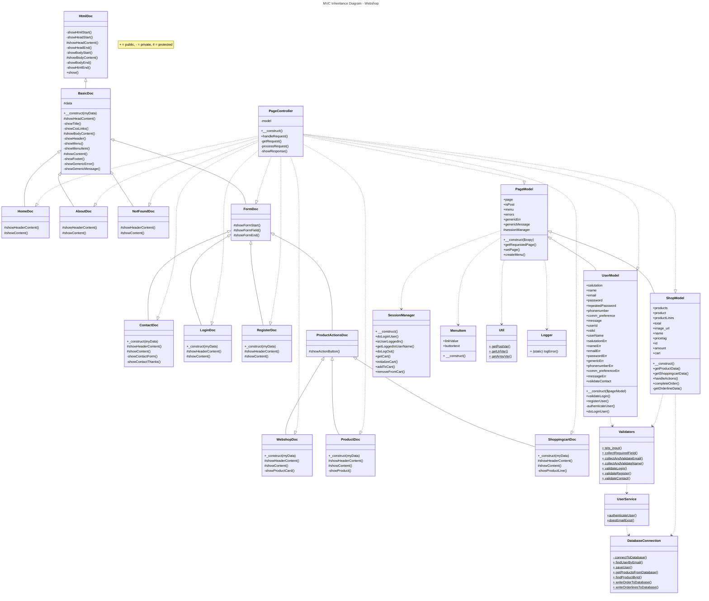

```mermaid
---
title: MVC Inheritance Diagram - Webshop
---
classDiagram
    note "+ = public, - = private, # = protected"
    %% A --|> B means that class A inherits from class B %%
    %% A ..|> B means that class A creates class B %%
    %% A ..> B means that class A depends on class B %%
    %% a static class of method ends with an $ %%
    HtmlDoc <|-- BasicDoc

    BasicDoc <|-- HomeDoc
    BasicDoc <|-- AboutDoc
    BasicDoc <|-- NotFoundDoc
    BasicDoc <|-- FormDoc

    FormDoc <|-- ContactDoc
    FormDoc <|-- LoginDoc
    FormDoc <|-- RegisterDoc
    FormDoc <|-- ProductActionsDoc
        
    ProductActionsDoc  <|-- WebshopDoc
    ProductActionsDoc  <|-- ProductDoc
    ProductActionsDoc  <|-- ShoppingcartDoc

    PageModel <|-- UserModel 
    PageModel <|-- ShopModel
    PageModel ..> SessionManager
    PageModel ..> MenuItem
    PageModel ..> Util
    PageModel ..> Logger

    UserModel ..> Validators
    Validators ..> UserService
    UserService ..> DatabaseConnection
    ShopModel ..> Validators
    ShopModel ..> DatabaseConnection

    PageController ..|> PageModel
    PageController ..|> UserModel
    PageController ..|> ShopModel

    PageController ..|> HomeDoc
    PageController ..|> AboutDoc
    PageController ..|> NotFoundDoc
    PageController ..|> FormDoc
    PageController ..|> ContactDoc
    PageController ..|> LoginDoc
    PageController ..|> RegisterDoc
    PageController ..|> WebshopDoc
    PageController ..|> ProductDoc
    PageController ..|> ShoppingcartDoc

    class PageController{
    -model

    +__construct()
    +handleRequest()
    -getRequest()
    -processRequest()
    -showResponse()
    }

    class PageModel{
    +page
    +isPost
    +menu
    +errors
    +genericErr
    +genericMessage
    #sessionManager

    +__construct($copy)
    +getRequestedPage()
    +setPage()
    +createMenu()
    }


    class UserModel{
    +salutation
    +name
    +email    
    +password
    +repeatedPassword
    +phonenumber
    +comm_preference
    +message

    +userId
    +valid
    +userName

    +salutationErr
    +nameErr
    +emailErr
    +passwordErr
    +genericErr
    +phonenumberErr
    +comm_preferenceErr
    +messageErr
    
    +__construct($pageModel)
    +validateLogin()
    +registerUser()
    +validateContact
    -authenticateUser()
    +doLoginUser()

    }

    class ShopModel{
    +products
    +product
    +productLines
    +total
    +image_url
    +name
    +pricetag
    +id
    +amount
    +cart

    +__construct()
    +getProductData()
    +getShoppingcartData()
    +handleActions()
    +completeOrder()
    -getOrderlineData()
    
    }

    class HtmlDoc{
       -showHtmlStart()
       -showHeadStart()
       #showHeadContent()
       -showHeadEnd()
       -showBodyStart()
       #showBodyContent()
       -showBodyEnd()
       -showHtmlEnd()
        +show()
    }

    class BasicDoc{
        #data 

        +__construct(myData)
        #showHeadContent()
        -showTitle()
        -showCssLinks()
        #showBodyContent()
        -showHeader()
        -showMenu()
        -showMenuItem()
        #showContent()
        -showFooter()
        -showGenericError()
        -showGenericMessage()
    }

    class HomeDoc{
        #showHeaderContent()
        #showContent()
    }

    class AboutDoc{
        #showHeaderContent()
        #showContent()
    }

    class NotFoundDoc{
        #showHeaderContent()
        #showContent()
    }

 class FormDoc{
        #showFormStart()
        #showFormField()
        #showFormEnd()
    }

    class ContactDoc{

        +_construct(myData)
        #showHeaderContent()
        #showContent()
        -showContactForm()
        -showContactThanks()
    }

    class LoginDoc{

        +_construct(myData)
        #showHeaderContent()
        #showContent()
    }

    class RegisterDoc{

        +_construct(myData)
        #showHeaderContent()
        #showContent()
    }

    class ProductActionsDoc{
        #showActionButton()
    }

    class WebshopDoc{
        +_construct(myData)
        #showHeaderContent()
        #showContent()
        -showProductCard()
    }

    class ShoppingcartDoc{
        +_construct(myData)
        #showHeaderContent()
        #showContent()
        -showProductLine()
    }

    class ProductDoc{
        +_construct(myData)
        #showHeaderContent()
        #showContent()
        -showProduct()
    }

    class Logger{
    + (static) logError()
    }

    class MenuItem{
    +linkValue
    +buttontext

    + __construct()
    }

    class SessionManager{
    + __construct()
    +doLoginUser()
    +isUserLoggedIn()
    +getLoggedInUserName()
    +doLogOut()
    +getCart()
    +initializeCart()
    +addToCart()
    +removeFromCart()
    }

    class UserService{
    +authenticateUser()$
    +doesEmailExist()$
    }

    class Util{
    + getPostVar()$
    + getUrlVar()$
    + getArrayVar()$
    }

    class Validators{
    + tets_input()$
    + collectRequiredField()$
    + collectAndValidateEmail()$
    + collectAndValidateName()$
    + validateLogin()$
    + validateRegister()$
    + validateContact()$
    }

    class DatabaseConnection{
    - connectToDatabase()$
    + findUserByEmail()$
    + saveUser()$
    + getProductsFromDatabase()$
    + findProductById()$
    + writeOrderToDatabase()$
    + writeOrderlinesToDatabase()$    
    }
```
